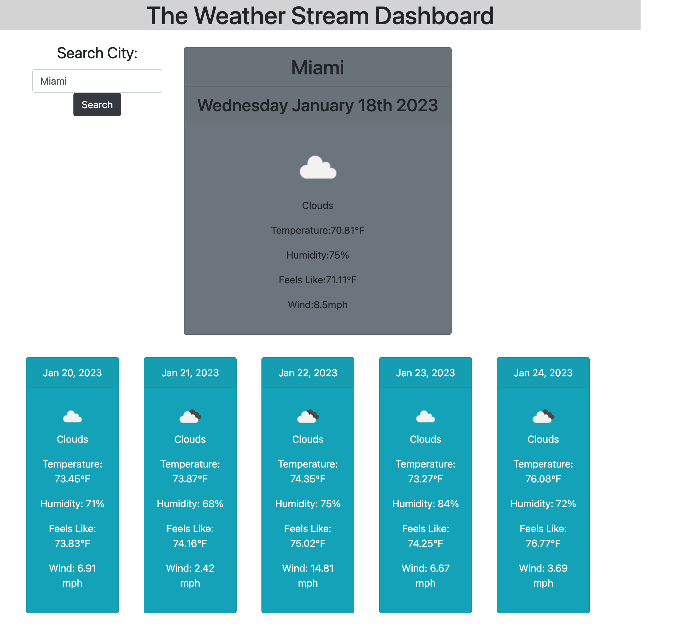

# Server-Side APIs: Weather Dashboard

## Description 

This application includes Open Weather API. The app allows the user to search a city and return the current day weather as well as 5 day ahead weather. The weather contains date, icon, description, temperature, feels like, humidity, and wind speed. When the user search a city, the city will be logged into their local storage. 


## User Story

```
AS A traveler
I WANT to see the weather outlook for multiple cities
SO THAT I can plan a trip accordingly
```

## Acceptance Criteria

```
GIVEN a weather dashboard with form inputs
WHEN I search for a city
THEN I am presented with current and future conditions for that city and that city is added to the search history
WHEN I view current weather conditions for that city
THEN I am presented with the city name, the date, an icon representation of weather conditions, the temperature, the humidity, and the wind speed
WHEN I view future weather conditions for that city
THEN I am presented with a 5-day forecast that displays the date, an icon representation of weather conditions, the temperature, the wind speed, and the humidity
WHEN I click on a city in the search history
THEN I am again presented with current and future conditions for that city
```

## Mock-Up

The following image shows the web application's appearance and functionality:




- - -
© 2022 edX Boot Camps LLC. Confidential and Proprietary. All Rights Reserved.
